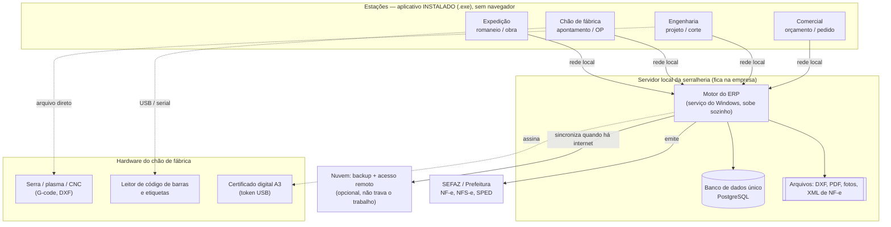

# Arquitetura do ERP: integrado, instalado localmente, sem depender do navegador

> Documento de decisão de arquitetura. Escrito em linguagem direta, para ser lido por quem
> toma a decisão de negócio — não só por quem programa.

## 1. A confusão que precisa ser desfeita

Existem duas coisas diferentes que costumam ser tratadas como uma só:

| | O que é | Exemplo |
|---|---|---|
| **Tecnologia web** | A forma de desenhar a tela (HTML/CSS/JS) | Qualquer app moderno |
| **Navegador** | O programa (Chrome/Edge) onde a tela abre | Aba do Chrome |

**Dá para usar tecnologia web sem usar navegador.** VS Code, WhatsApp Desktop, Discord,
Spotify, Notion, Figma Desktop — todos são feitos com tecnologia web e todos são
**programas instalados**, com ícone na área de trabalho, que abrem sem Chrome, funcionam
offline e conversam com o hardware da máquina.

Ou seja: a resposta para "quero instalador local e não ficar preso ao navegador" **não é**
jogar fora a tecnologia moderna. É **empacotar** essa tecnologia dentro de um aplicativo
próprio.

## 2. As três arquiteturas possíveis

### A) 100% nuvem (SaaS no navegador)
Tudo roda em servidor da internet, o usuário só abre o Chrome.

- ✅ Zero instalação, atualiza sozinho
- ❌ **Internet caiu, a serralheria parou**
- ❌ Não fala com balança, leitor de código de barras, CNC, token A3 do certificado digital
- ❌ Seus dados moram na casa dos outros

### B) 100% local (instalador em cada máquina, cada uma com seu banco)
Cada computador tem uma cópia isolada.

- ✅ Funciona sem internet, dados na sua casa
- ❌ **Não é integrado**: o orçamento do vendedor não enxerga o estoque do almoxarifado
- ❌ Backup e atualização viram problema manual em cada máquina

### C) Local-first com servidor na própria serralheria + espelho na nuvem ← **RECOMENDADO**

Um computador da empresa (ou um mini-servidor) guarda o **banco de dados único**. As
estações (escritório, produção, expedição) têm o **aplicativo instalado** e conversam com
esse servidor pela rede interna. A nuvem entra só como **cópia de segurança e acesso
remoto** — não como dependência para trabalhar.

- ✅ Integrado de verdade (um banco só, todo mundo vê o mesmo dado)
- ✅ Internet caiu? A fábrica continua produzindo — é rede local
- ✅ Fala com o hardware do chão de fábrica
- ✅ Dados são seus; backup automático fora da empresa
- ⚠️ Exige um servidor na empresa e uma rotina de atualização (ambos resolvidos abaixo)

## 3. Como fica o desenho

**Regra de ouro:** a seta para a nuvem e a seta para a SEFAZ podem **quebrar sem parar a
fábrica**. Tudo que é essencial acontece dentro do quadrado do servidor local.

## 4. O que significa "tudo integrado"

Integrado **não é** ter vários programas que exportam planilha um para o outro. É ter
**um único cadastro e um único banco**, onde um evento em um módulo alimenta o próximo
automaticamente. No caso de serralheria, o fluxo natural:

1. **Comercial** — orçamento com medidas do vão, perfil, vidro, acabamento
2. **Engenharia** — vira projeto; gera a lista de corte e o DXF
3. **Compras/Estoque** — o sistema já sabe quantas barras de perfil faltam
4. **Produção (PCP)** — ordem de produção, otimização de corte (nesting), apontamento
5. **Expedição/Obra** — romaneio, instalação, medição
6. **Financeiro/Fiscal** — nota fiscal, contas a receber, custo real x orçado

O ganho está exatamente nas passagens: **a medida digitada uma vez pelo vendedor é a mesma
que sai no corte da barra e na nota fiscal.** Ninguém redigita, ninguém erra medida.

Tecnicamente, isso se garante com:
- **Um banco de dados único** (não um por módulo)
- **Eventos internos** ("orçamento aprovado" → cria OP automaticamente)
- **Módulos plugáveis**: o ERP começa com o essencial e cresce por partes, sem reescrever

## 5. Por que o navegador puro não serve para serralheria

Isto não é preferência, é limitação técnica real. Uma aba de navegador **não consegue**
(ou consegue muito mal):

| Necessidade da serralheria | Navegador | App instalado |
|---|---|---|
| Ler token USB do certificado digital A3 | ❌ | ✅ |
| Enviar G-code/DXF direto para a pasta da máquina de corte | ❌ | ✅ |
| Ler balança, leitor serial, impressora de etiqueta Zebra | ⚠️ limitado | ✅ |
| Trabalhar com a internet caída | ⚠️ limitado | ✅ |
| Abrir e manipular arquivos pesados de CAD do disco | ⚠️ | ✅ |
| Rodar rápido em PC antigo do chão de fábrica | ⚠️ | ✅ |

## 6. Escolhas técnicas concretas

| Camada | Escolha | Por quê |
|---|---|---|
| **Tela (aplicativo)** | **Tauri** (alternativa: Electron) | Gera `.exe`/instalador Windows; app leve (~10 MB contra ~150 MB do Electron); acessa arquivos e hardware |
| **Motor do ERP** | **Python (FastAPI)** rodando como serviço do Windows | Sobe junto com o PC, sem ninguém precisar clicar; ecossistema forte de fiscal/NF-e em Python |
| **Banco de dados** | **PostgreSQL** embutido no instalador | Robusto, gratuito, aguenta a serralheria inteira; SQLite só se for **uma** máquina |
| **Instalador** | **MSI/NSIS** com tudo dentro | O cliente dá "Avançar, Avançar, Concluir" — banco, motor e app juntos |
| **Atualização** | Auto-update assinado | Resolve o "tenho que ir em cada máquina" |
| **Backup** | Automático: cópia local + envio cifrado para nuvem | Resolve o maior risco do modelo local |
| **Sincronização** | Fila de eventos (outbox) com reenvio | Se a internet cair, acumula e envia depois — sem perder nada |

### Dois tipos de instalador
1. **Instalador do Servidor** — roda **uma vez**, no PC que vai ser o servidor da empresa.
   Instala PostgreSQL + motor do ERP + serviço automático.
2. **Instalador da Estação** — roda em cada máquina de usuário. Só o aplicativo; na
   primeira abertura ele pergunta o endereço do servidor (ou acha sozinho na rede).

## 7. Riscos do modelo local — e como cada um é fechado

| Risco real | Como se resolve |
|---|---|
| "O PC do servidor queimou" | Backup automático cifrado na nuvem + procedimento de restauração testado |
| "Preciso atualizar 8 máquinas" | Auto-update: o app se atualiza sozinho ao abrir |
| "Quero ver o faturamento de casa" | Espelho na nuvem, só leitura, com login separado |
| "Suporte precisa entrar na máquina" | Acesso remoto (AnyDesk/RustDesk) + log do sistema |
| "E se a rede interna cair?" | Estação guarda o que foi digitado e envia quando voltar |

## 8. Como isso se conecta com esta fábrica de software

Este repositório já tem o mecanismo certo para construir um ERP grande com segurança:

- Cada **módulo** do ERP (orçamento, estoque, produção, fiscal…) entra como um PR da
  fábrica, pequeno e revisável.
- Cada módulo só é aceito com **testes de aceitação em `trusted_tests/`** que provam,
  em caixa-preta, que o módulo faz o que foi pedido.
- O `factory-verify` garante que o código gerado **não mexe nas próprias regras** que o
  julgam (ver `docs/SEGURANCA.md`).

Traduzindo: o ERP não nasce de uma vez. Nasce módulo a módulo, cada um testado antes de
entrar — que é exatamente como se constrói um ERP que não vira uma bola de neve.

## 9. Ordem sugerida de construção

1. **Fundação** — instalador do servidor + banco + app abrindo com login (o "esqueleto")
2. **Cadastros** — clientes, fornecedores, perfis, vidros, ferragens, serviços
3. **Orçamento** — o módulo que gera dinheiro primeiro; já com cálculo por vão/medida
4. **Estoque e compras** — o que o orçamento aprovado consome
5. **Produção/PCP** — ordem de produção, lista de corte, otimização de barras
6. **Fiscal/Financeiro** — NF-e, contas a receber/pagar, custo real x orçado
7. **Sincronização com a nuvem** — backup e acesso remoto

Cada etapa entrega algo **utilizável**. Não existe fase em que a serralheria fica esperando.

---

## Resumo em uma frase

Aplicativo **instalado** (feito com tecnologia web, mas fora do navegador) + **um servidor
com um banco único dentro da própria serralheria** + **nuvem só como backup**: é assim que
se tem um ERP totalmente integrado, que funciona com a internet caída, fala com as máquinas
de corte e o certificado digital, e instala com "Avançar, Avançar, Concluir".
